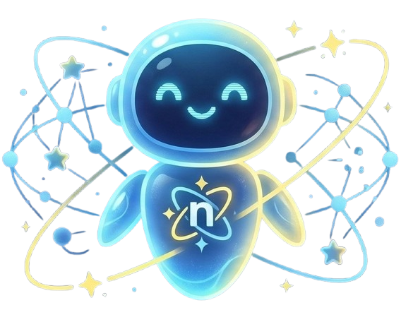

# STARNION


> **"Your Stellar Companion in Every Task."**
> *모든 작업의 빛나는 동반자*

---

## Brand Identity

StarNion은 밤하늘의 북극성처럼 사용자의 복잡한 작업 흐름 속에서 명확한 길을 제시하는 **AI 네비게이터**입니다.

### Symbol


중심의 4각 별(Star)과 이를 부드럽게 감싸는 궤도(Orbit)로 구성된 StarNion의 공식 심볼.
궤도는 'Nion'의 'n'을 형상화하면서 동시에 끊이지 않는 연결성을 상징합니다.

---

## Brand Essence

| 항목 | 내용 |
|------|------|
| **Slogan** | "Your Stellar Companion in Every Task." |
| **Mission** | 사용자에게 단순한 답변을 넘어, 목표에 도달하는 최적의 경로(Context)를 제안한다 |

---

## Core Values — C.O.R.E.

| 가치 | 설명 |
|------|------|
| **C — Connectivity (연결)** | 사용자의 모든 작업, 기기, 정보를 유기적으로 연결합니다 |
| **O — Optimization (최적화)** | 복잡한 작업 흐름 속에서 최적의 경로와 해답을 제시합니다 |
| **R — Reliability (신뢰)** | 일관되고 정확한 응답으로 사용자의 신뢰를 구축합니다 |
| **E — Enlightenment (통찰)** | 데이터 속에서 숨겨진 인사이트를 발견하여 사용자를 밝힙니다 |

---

## Character — 니온(Nion)

<p align="center">
  
</p>

StarNion의 공식 AI 캐릭터 **니온(Nion)**은 차가운 기계가 아닌, 든든하고 위트 있는 조력자입니다.

### 이름의 의미 — 세 가지 층위

#### 1. Stellar Companion (별의 동반자)
> 어원: **Star** + **Companion**

밤하늘의 북극성처럼 사용자의 모든 작업에서 길을 밝혀주는 가장 든든한 AI 조력자. 해맑은 미소는 사용자와 함께 성장하는 친근한 파트너임을 상징합니다.

#### 2. Always 'On' (언제나 깨어있는 지능)
> 어원: **N** + **On**

사용자가 필요로 하는 순간, 언제 어디서든 즉시 응답하는 Always-On AI. 캐릭터 전체에서 내뿜는 빛은 끊임없이 가동되는 지능과 혁신적인 에너지를 시각화합니다.

#### 3. Core of Connectivity (연결의 핵심)
> 디자인: 가슴의 로고 + 동심원 궤도(Layer)

복잡한 데이터 레이어들을 분석하여 가장 최적화된 해답을 찾아내는 지능형 연결의 중심. 가슴의 로고는 니온의 심장이자 모든 정보가 연결되는 핵심점입니다.

### 성격

- **Tone**: Friendly & Professional — 친근하지만 선을 지키는 전문적인 말투
- **Proactive**: 사용자가 막히는 부분을 먼저 감지하여 선제적으로 도움을 제안
- **Empathetic**: 차가운 인공지능이 아닌, 사용자와 함께 성장하는 파트너

---

## Visual System

| 항목 | 내용 |
|------|------|
| **Stellar Blue** | `#1E3A8A` — 무한한 가능성과 신뢰의 우주색 |
| **Nova Yellow** | `#FDE047` — 명확한 해답과 에너지를 상징하는 포인트 컬러 |
| **Typography** | Montserrat / Pretendard (산세리프 계열, 현대적 IT 브랜드 이미지) |

---

## Overview

Starnion은 Hyper-Personalized AI Agent 플랫폼입니다. 웹 UI, Telegram 등 멀티 채널에서 자연어 가계부, 일기, 목표 관리, 메모, 메모리/RAG 검색, 멀티모달 입력, 예산 관리, 프로액티브 알림을 제공합니다.

### Core Features

| Feature | Description |
|---------|-------------|
| **Natural Language Finance** | "점심 김치찌개 9000원" → 자동 카테고리 분류 + 기록 |
| **Budget Management** | 카테고리별 예산 설정, 사용률 추적, 초과 경고 |
| **Diary / Daily Log** | 일상 기록 저장 + 감정 분석 + 벡터 임베딩 |
| **Goals & Habits** | 목표 설정, 체크인, 스트릭, 진행률 추적 |
| **Memo** | 태그 기반 메모 CRUD + 통합 검색 |
| **Memory / RAG** | 4계층 메모리 검색 (일상기록, 지식, 문서, 가계부) |
| **Multimodal** | 이미지 분석, PDF 텍스트 추출, 음성 인식 |
| **Proactive Notifications** | 주간 리포트 자동 발송 (매주 월요일 09:00 KST) |
| **Statistics & Analytics** | 소비 패턴 분석, 인사이트 리포트 |
| **Web Chat** | 실시간 WebSocket 기반 AI 채팅 |

---

## Architecture

```
Web UI (Next.js)  /  Telegram
         │                │
         ▼                ▼
┌────────────────────────────────────────┐
│  Go Gateway (:8080)                    │
│  ├─ REST API (/api/v1/*)               │
│  ├─ WebSocket (/ws)                    │
│  ├─ Telegram Bot (polling)             │
│  ├─ Cron Scheduler                     │
│  └─ gRPC Client ──────────────────┐   │
└───────────────────────────────────┼───┘
                                    │ gRPC (unary)
                                    ▼
┌────────────────────────────────────────┐
│  Python Agent (:50051)                 │
│  ├─ LangGraph ReAct Agent              │
│  │   └─ Multi-LLM (Gemini / OpenAI / …)│
│  ├─ Tools                              │
│  │   ├─ save_finance                   │
│  │   ├─ get_monthly_total              │
│  │   ├─ retrieve_memory (RAG)          │
│  │   ├─ save_daily_log                 │
│  │   ├─ set_budget / get_budget        │
│  │   ├─ process_image (Vision)         │
│  │   ├─ process_document (PDF)         │
│  │   └─ process_voice (STT)            │
│  ├─ Embedding Service                  │
│  │   └─ gemini-embedding-001 (768d)    │
│  └─ 4-Layer Memory Retriever           │
│      ├─ daily_logs      (vector)       │
│      ├─ knowledge_base  (vector)       │
│      ├─ document_sections (vector)     │
│      └─ finances        (recent)       │
└────────────────────────────────────────┘
                    │
                    ▼
┌────────────────────────────────────────┐
│  PostgreSQL 16 + pgvector              │
│  ├─ profiles / credentials             │
│  ├─ finances / budgets                 │
│  ├─ diary_entries                      │
│  ├─ goals / goal_checkins              │
│  ├─ memos                              │
│  ├─ cron_schedules                     │
│  ├─ daily_logs          (vector)       │
│  ├─ knowledge_base      (vector)       │
│  ├─ document_sections   (vector)       │
│  └─ checkpoints (LangGraph state)      │
└────────────────────────────────────────┘
```

---

## Tech Stack

| Layer | Technology |
|-------|------------|
| **Web UI** | Next.js 15 + Tailwind CSS + shadcn/ui |
| **Auth** | NextAuth.js (Credentials + Google OAuth) |
| **LLM** | Google Gemini / OpenAI GPT / Anthropic Claude |
| **Embedding** | gemini-embedding-001 (768 dims) |
| **Agent Framework** | LangGraph (ReAct pattern) |
| **Agent Runtime** | Python 3.13 + gRPC |
| **Gateway** | Go + Echo + go-telegram-bot-api |
| **Database** | PostgreSQL 16 + pgvector (HNSW) |
| **File Storage** | MinIO |
| **Messaging** | Telegram Bot API |
| **Scheduler** | robfig/cron (KST) |
| **Containerization** | Docker Compose |

---

## Project Structure

```
starnion/
├── ui/                             # Next.js Web UI
│   ├── app/
│   │   ├── (dashboard)/            # Dashboard pages
│   │   │   ├── finance/            # 가계부
│   │   │   ├── budget/             # 예산 관리
│   │   │   ├── statistics/         # 소비 분석
│   │   │   ├── diary/              # 일기
│   │   │   ├── goals/              # 목표 관리
│   │   │   ├── memo/               # 메모
│   │   │   ├── analytics/          # 통계/분석
│   │   │   ├── chat/               # 웹챗
│   │   │   └── settings/           # 설정
│   │   └── api/                    # Next.js API routes (proxy)
│   └── components/                 # UI components
├── agent/                          # Python Agent Service
│   └── src/starnion_agent/
│       ├── graph/agent.py          # LangGraph ReAct agent
│       ├── grpc/server.py          # gRPC server
│       ├── tools/                  # Agent tools
│       ├── memory/retriever.py     # 4-layer memory retriever
│       └── embedding/service.py   # Gemini embedding service
├── gateway/                        # Go Gateway Service
│   ├── cmd/gateway/                # Entry point
│   └── internal/
│       ├── handler/                # REST API handlers
│       ├── telegram/               # Telegram bot
│       ├── scheduler/              # Cron scheduler
│       ├── identity/               # Platform identity service
│       └── storage/                # MinIO file storage
├── proto/starnion/v1/              # gRPC service definition
└── docker/
    ├── docker-compose.yml          # Full stack orchestration
    ├── init.sql                    # Database schema + pgvector
    ├── migrations/                 # Incremental DB migrations
    └── Dockerfile.*                # Container definitions
```

---

## Quick Start

### Prerequisites

- Python 3.13+, Go 1.22+, Node.js 20+, Docker
- Google Gemini API Key (or OpenAI / Anthropic)
- Telegram Bot Token (optional, [@BotFather](https://t.me/BotFather))

### Setup

```bash
# 1. Configure environment
cp .env.example .env
# Edit .env: GEMINI_API_KEY, TELEGRAM_BOT_TOKEN, DATABASE_URL

# 2. Start infrastructure (PostgreSQL + MinIO)
cd docker && docker compose up -d postgres minio

# 3. Start Agent (Python gRPC server)
cd agent && uv run python -m starnion_agent
# → gRPC server starting on [::]:50051

# 4. Start Gateway (Go HTTP + Telegram)
cd gateway && go run ./cmd/gateway
# → Gateway server starting on :8080

# 5. Start Web UI
cd ui && pnpm install && pnpm dev
# → Next.js running on http://localhost:3000
```

### Verify

```bash
# Health check
curl localhost:8080/healthz
# → {"status":"ok"}

# HTTP API test
curl -X POST http://localhost:8080/api/v1/chat \
  -H 'Content-Type: application/json' \
  -d '{"user_id": "test-user", "message": "점심 만원"}'
```

---

## API Endpoints

| Method | Path | Description |
|--------|------|-------------|
| GET | `/healthz` | Health check |
| POST | `/api/v1/chat` | Send message to agent |
| POST | `/api/v1/chat/stream` | SSE streaming chat |
| GET/POST | `/api/v1/finance/transactions` | 가계부 CRUD |
| GET/PUT | `/api/v1/budget` | 예산 관리 |
| GET | `/api/v1/statistics` | 소비 통계 |
| GET/POST | `/api/v1/diary/entries` | 일기 CRUD |
| GET/POST | `/api/v1/goals` | 목표 관리 CRUD |
| GET/POST | `/api/v1/memos` | 메모 CRUD |
| GET/POST | `/api/v1/cron/schedules` | 스케줄 관리 |
| GET/POST | `/api/v1/providers` | LLM 프로바이더 설정 |
| GET/POST | `/api/v1/personas` | 페르소나 관리 |

---

## License

Private project. All rights reserved.
