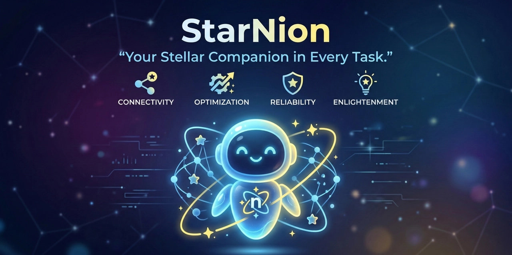

<div align="center">



# ✦ StarNion

**Your Stellar Companion in Every Task.**

A hyper-personalized AI agent platform with Planner, finance management, and AI-powered daily life assistance — accessible from Web and Telegram.

[](https://github.com/jikime/starnion/releases)
[](LICENSE)

[Documentation](https://jikime.github.io/starnion/) · [Installation Guide](https://jikime.github.io/starnion/en/getting-started/installation) · [Korean Docs](https://jikime.github.io/starnion/ko/)

[](https://github.com/jikime/starnion/releases)
[](LICENSE)

[Documentation](https://jikime.github.io/starnion/) · [Installation Guide](https://jikime.github.io/starnion/en/getting-started/installation) · [Korean Docs](https://jikime.github.io/starnion/ko/)

</div>

---

## What is StarNion?

StarNion is a self-hosted personal AI agent platform. All your data stays on your own server while AI helps you manage your daily life more smartly — accessible from **Web UI**, **Telegram**, and a native **CLI**.

**Key highlights:**
- **Planner** — ABC priority-based daily/weekly/monthly planning with roles, goals, and mission statement
- **Finance & Assets** — expense tracking, spending map, budget management, statistics & analytics
- **AI Chat** — multi-provider LLM with personas, web search, and file management
- **Multi-provider LLM** — Anthropic Claude, Google Gemini, OpenAI, GLM (Z.AI), Ollama support
- **System Scheduler** — notification jobs (budget warning, daily summary, etc.) individually enabled/disabled per user
- **Language & Theme** — 4-language i18n (Korean, English, Japanese, Chinese) + dark/light theme
- **Personas** — configure custom AI personalities per conversation context
- **Telegram Integration** — full planner CRUD, chat, and notifications via Telegram bot
- **Privacy-first** — all data on your own PostgreSQL + MinIO

> Full feature documentation is available at **[jikime.github.io/starnion](https://jikime.github.io/starnion/)**.

---

## Requirements

| Component | Minimum Version | Notes |
|-----------|----------------|-------|
| **Node.js** | 20+ | Agent + Web runtime |
| **Python** | 3.11+ | AI skill scripts |
| **uv** | latest | Python package manager ([install](https://docs.astral.sh/uv/getting-started/installation/)) |
| **Docker** | 24+ (with Compose v2) | PostgreSQL + MinIO |
| **PostgreSQL** | 16 + pgvector | Database |
| **MinIO** | latest | File storage (S3-compatible) |

> **Go** is only required for source development (`starnion dev`), not for binary installs.

**AI Provider (at least one):**

- [Claude Code](https://claude.ai/) subscription — run `claude` → `/login` (recommended)
- [Google Gemini](https://aistudio.google.com/), [OpenAI](https://platform.openai.com/), [Anthropic API](https://console.anthropic.com/), [Ollama](https://ollama.com/) — configure in Settings → Models

---

## Installation

### One-line installer (Linux / macOS)

Requires **Node.js 20+**, **pnpm**, and **uv** (Python package manager).

```bash
# Install prerequisites
npm install -g pnpm
curl -LsSf https://astral.sh/uv/install.sh | sh   # uv (Python)

curl -fsSL https://jikime.github.io/starnion/install.sh | bash
```

The installer creates a Python virtual environment at `~/.starnion/venv/` with all skill dependencies.

After installation, PostgreSQL + MinIO must be running before setup:

```bash
# 1. Start PostgreSQL + MinIO
cp ~/.starnion/docker/.env.example ~/.starnion/docker/.env   # set your passwords
docker compose -f ~/.starnion/docker/docker-compose.yml up -d postgres minio

# 2. Run the setup wizard (7 steps: language, system check, DB, admin, MinIO, service config, AI provider)
starnion setup

# 3. Start all services
starnion start
```

### AI Provider Setup

Claude Code subscription (recommended):
```bash
claude        # Start Claude Code CLI
/login        # Authenticate (browser-based)
```
Credentials are saved to `~/.claude/.credentials.json` and auto-detected on service start.

Other providers (Gemini, OpenAI, Ollama, etc.): configure in the web UI at **Settings → Models**.

### Running as a systemd service

```bash
sudo cp ~/.starnion/scripts/starnion.service /etc/systemd/system/
sudo systemctl daemon-reload
sudo systemctl enable --now starnion
```

### Other ways to run

```bash
starnion start          # Binary mode (foreground)
starnion docker up -d   # Docker mode
starnion dev            # Development mode (requires Go + source)
```

### From source

```bash
git clone https://github.com/jikime/starnion.git
cd starnion

# Create docker environment file
cp docker/.env.example docker/.env

# Start PostgreSQL + MinIO
docker compose -f docker/docker-compose.yml up -d postgres minio

# Build the starnion CLI
make starnion

# Interactive setup wizard
./starnion setup

# Start all services (development mode)
./starnion dev
```

### Verify

```bash
curl http://localhost:8080/healthz
# {"status":"ok"}
```

> For detailed configuration options, Docker-only setup, and production deployment, see the **[Installation Guide](https://jikime.github.io/starnion/en/getting-started/installation)**.

---

## Architecture

```
┌──────────────────────┐   ┌──────────────────────┐
│   Web UI (Next.js)   │   │   Telegram Bot        │
│   localhost:3893     │   │   (polling)           │
└──────────┬───────────┘   └──────────┬────────────┘
           │                          │
           ▼                          ▼
┌──────────────────────────────────────────────────┐
│              Go Gateway  :8080                    │
│  REST API  ·  WebSocket  ·  Cron Scheduler        │
│                  │ gRPC (streaming)               │
└──────────────────┼───────────────────────────────┘
                   ▼
┌──────────────────────────────────────────────────┐
│           TypeScript Agent  :50051                │
│  AI SDK v5  ·  Multi-LLM  ·  Skills (30+)        │
│  Streaming SSE  ·  Tool Calls  ·  Planner Skills │
└──────────────────┬───────────────────────────────┘
                   ▼
┌──────────────────────────────────────────────────┐
│        PostgreSQL 16 + pgvector   (HNSW)          │
└──────────────────────────────────────────────────┘
          │
          ▼
┌─────────────────┐
│  MinIO (S3)     │  images · audio · documents
└─────────────────┘
```

| Layer | Technology |
|-------|------------|
| Web UI | Next.js 16 · React 19 · Tailwind CSS 4 · shadcn/ui · Pretendard |
| Auth | NextAuth.js v5 (Credentials) |
| Theme | next-themes (dark / light) |
| Gateway | Go · Echo · go-telegram-bot-api |
| Agent | TypeScript · Vercel AI SDK v5 · gRPC |
| LLM | Anthropic Claude · Google Gemini · OpenAI · GLM (Z.AI) · Ollama |
| Embedding | OpenAI text-embedding-3-small · Gemini text-embedding |
| Database | PostgreSQL 16 · pgvector (HNSW) |
| File Storage | MinIO (S3-compatible) |
| Scheduler | robfig/cron (per-user toggleable) |
| i18n | next-intl (ko · en · ja · zh) |
| Runtime | Docker Compose |

---

## Project Structure

```
starnion/
├── web/                  # Next.js 16 Web UI  (:3893)
│   ├── app/(main)/       # Route pages (chat, files, planners, assets, analytics, ...)
│   ├── components/       # Feature-based components
│   │   ├── planner/      # Planner components
│   │   ├── chat/         # Chat components
│   │   ├── files/        # File management components
│   │   ├── search/       # Web search components
│   │   ├── skills/       # Skills management
│   │   ├── logs/         # System logs viewer
│   │   ├── usage/        # API usage analytics
│   │   ├── finance/      # Finance (ledger) view
│   │   ├── budget/       # Budget management view
│   │   ├── statistics/   # Spending statistics view
│   │   └── finance-map/  # Naver Maps spending map
│   └── messages/         # i18n translations (ko, en, ja, zh)
├── agent/                # TypeScript AI agent (gRPC :50051)
│   └── skills/           # 30+ skill definitions
│       ├── planner-tasks/    # Daily task CRUD
│       ├── planner-inbox/    # Inbox management
│       ├── planner-roles/    # Role management
│       ├── planner-goals/    # D-Day goal management
│       ├── planner-weekly/   # Weekly Key Goals
│       ├── planner-diary/    # Diary with mood
│       ├── planner-reflection/ # Reflection notes
│       ├── planner-mission/  # Mission statement
│       ├── finance/          # Finance tracking
│       ├── budget/           # Budget management
│       ├── websearch/        # Web search
│       ├── image/            # Image generation/analysis
│       ├── audio/            # Audio transcription/TTS
│       └── ...               # Other skills
├── gateway/              # Go gateway — REST API + Telegram + Cron  (:8080)
├── starnion-cli/         # Go CLI tool (starnion command)
├── proto/                # Protobuf / gRPC definitions
├── db/
│   └── migrations/       # PostgreSQL schema migrations
└── docker/
    ├── docker-compose.yml
    ├── docker-compose.prod.yml
    └── .env.example
```

---

## Features

| Category | Features |
|----------|----------|
| **Planner** | ABC priority tasks · Weekly Key Goals · Monthly calendar · D-Day goals · Mission & Roles · Diary & Reflection |
| **Finance** | Expense tracking · Spending map (Naver Maps) · Budget management · Statistics & Analytics |
| **AI Chat** | Multi-LLM conversations · Personas · WebSocket streaming · Telegram integration |
| **Files** | Document & image upload · Audio transcription · AI document search · MinIO storage |
| **Web Search** | AI-powered web search with streaming · Search history & auto-save |
| **Skills** | 30+ AI skills · API key management · Google OAuth · Per-skill toggle |
| **Channels** | Web chat · Telegram bot · Channel management · Pairing requests |
| **Settings** | Model providers · Pricing · Account · Notifications · System logs · Usage analytics |

---

## Web UI Pages

| Menu | Route | Description |
|------|-------|-------------|
| Chat | `/chat` | AI chat with sidebar, model selection, personas |
| Files | `/files` | File management with grid/list view, search, upload |
| Planner | `/planners` | Planner (daily/weekly/monthly/goals/compass) |
| Assets | `/assets` | Finance ledger · Statistics · Budget · Spending map |
| Analytics | `/analytics` | Message analytics · Channel breakdown · Anomaly detection |
| Search | `/search` | AI web search with history |
| Skills | `/skills` | Skill management with API keys |
| Logs | `/logs` | Real-time system logs (SSE/polling) |
| Usage | `/usage` | API usage analytics with charts |
| Settings | `/settings` | Account · Password · Timezone |
| Notifications | `/cron` | Scheduled notifications & system jobs |
| Models | `/models` | LLM provider configuration & pricing |
| Personas | `/personas` | AI personality management |

---

## Planner Database Tables

| Table | Description |
|-------|-------------|
| `planner_roles` | Life roles with color, mission, Key Goal |
| `planner_tasks` | Daily tasks with ABC priority + inbox items |
| `planner_weekly_goals` | Weekly Key Goals per role |
| `planner_goals` | D-Day goals with due dates |
| `planner_diary` | Daily diary with mood tracking |
| `planner_reflection_notes` | Reflection notes (JSONB) |

---

## Documentation

Full documentation is hosted at **[jikime.github.io/starnion](https://jikime.github.io/starnion/)**.

| | 🇺🇸 English | 🇰🇷 한국어 | 🇯🇵 日本語 | 🇨🇳 中文 |
|-|------------|-----------|----------|---------|
| Introduction | [Introduction](https://jikime.github.io/starnion/en/getting-started/introduction) | [소개](https://jikime.github.io/starnion/ko/getting-started/introduction) | [Starnionとは](https://jikime.github.io/starnion/ja/getting-started/introduction) | [简介](https://jikime.github.io/starnion/zh/getting-started/introduction) |
| Quick Start | [Quick Start](https://jikime.github.io/starnion/en/getting-started/quickstart) | [빠른 시작](https://jikime.github.io/starnion/ko/getting-started/quickstart) | [クイックスタート](https://jikime.github.io/starnion/ja/getting-started/quickstart) | [快速开始](https://jikime.github.io/starnion/zh/getting-started/quickstart) |
| Installation | [Installation](https://jikime.github.io/starnion/en/getting-started/installation) | [설치 가이드](https://jikime.github.io/starnion/ko/getting-started/installation) | [インストール](https://jikime.github.io/starnion/ja/getting-started/installation) | [安装指南](https://jikime.github.io/starnion/zh/getting-started/installation) |
| Architecture | [Architecture](https://jikime.github.io/starnion/en/architecture/overview) | [아키텍처](https://jikime.github.io/starnion/ko/architecture/overview) | [アーキテクチャ](https://jikime.github.io/starnion/ja/architecture/overview) | [架构](https://jikime.github.io/starnion/zh/architecture/overview) |

---

## License

Private project. All rights reserved.
